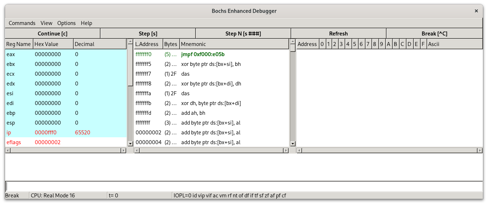

# x86_assembly环境
## 1.安装汇编编译器
本文的操作系统是Archlinux，此环境的包管理工具是pacman，故利用其进行安装。
````bash
sudo pacman -S nasm
````
bochs是一款x86平台的开源模拟器，通过他学习x86环境下的汇编语言，版本最好选择2.7往后，其修改了堆栈查看会阻塞程序运行的问题。
## 2.安装bochs
````bash
sudo pacman -S bochs
````

## 3.在文件夹下添加bochs启动文件
````bash
cd 文件夹名
bochs -q
````
将出现以下内容
````bash
------------------------------
Bochs Configuration: Main Menu
------------------------------

This is the Bochs Configuration Interface, where you can describe the
machine that you want to simulate.  Bochs has already searched for a
configuration file (typically called bochsrc.txt) and loaded it if it
could be found.  When you are satisfied with the configuration, go
ahead and start the simulation.

You can also start bochs with the -q option to skip these menus.

1. Restore factory default configuration
2. Read options from...
3. Edit options
4. Save options to...
5. Restore the Bochs state from...
6. Begin simulation
7. Quit now

Please choose one: [2] 

````
此时在终端输入4
````bash
Save configuration to what file?  To cancel, type 'none'.
[none] 
````
然后输入bochsrc，再输入7退出。此时在所在文件夹内会出现bochsrc的文件。

## 4.配置bochsrc文件

````js
##bochsrc文件内

#在display_library后添加options项，内容为gui_debug
display_library: x, options="gui_debug"

#在boot项，其后内容改为disk
boot: disk

#foppy后三行与下面一致
floppy_bootsig_check: disabled=0
# no floppya
# no floppyb
````

结束上面的配置后，还要配置磁盘。
````bash
#在bash内输入
bximge
#紧接着输入
1
#回车或者输入hd
hd
#回车或输入flat
flat
#回车，或者修改扇区大小，默认为512
512
#修改磁盘大小为16M
16
#更改磁盘名字
master.img
#随后会出现如下一行代码
ata0-master: type=disk, path="master.img" mode=flat
````
之后将出现的那一行代码覆盖到bochsrc内的ata0-master行完成磁盘的配置，然后通过如下命令将编译后的bin文件写入磁盘
````bash
# conv=notrunc表示不作扇区截断，这样img文件就是之前配置的16M，而不会是512字节
dd if=hello.bin of=master.img bs=512 count=1 conv=notrunc
````

最后通过bochs -q启动x86模拟环境

按下countiune或者在文本框输入c即可得到下面的画面
